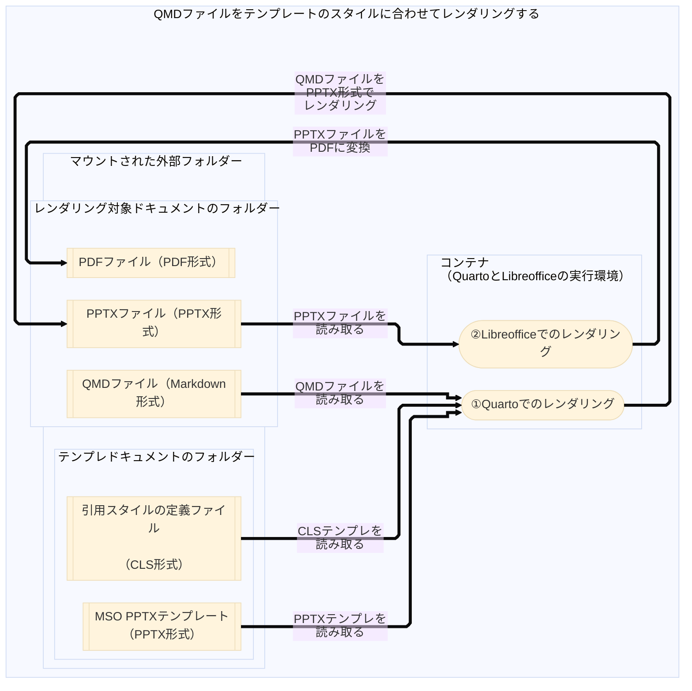

# QuartoとLibreofficeによる、マークダウン記法でのプレゼンテーション内容をレンダリングファイルに自動変換

* 目的
  * マークダウン記法でのプレゼンテーション内容をレンダリングファイルに自動変換する手順を共有

* 処理概要
  * マークダウン`md`記法での内容をテンプレート（`pptx`のマスタスライド、`cls`、`bib`）でレンダリング
  * レンダリングされた`pptx`を`pdf`に自動変換


* メリット
  * テンプレートによる、レンダリングのスタイルとレイアウトをチーム内統一し、再現性を向上させる
  * 内容をテンプレートを分けって、内容のバージョンの制御性を向上させる
  * 完全にOSSツールでMicrosoft Office様なコンテンツレンダリングをできる

* デメリット
  * マークダウン記法を練習しない内容（図、表、箇条書き、画像、リンクなど）の作成がしにくい
  * 更新した内容をレンダリング処理しない、レンダリング結果を見えない

* 実行環境の構築と利用

```bash
# Prerequisite: Get the latest version of docker desktop installed 

# [Step 1-1] Enter the working directory "quarto"
cd quarto_render
# [Step 1-2] Build the container
docker-compose build
# [Step 1-3] Shut down the old container if exists
docker-compose down
# [Step 1-4] Start the container
docker-compose up -d

# [Step 2-1] Enter the command line interface of the container
docker exec -it cnt_quarto bash
# [Step 2-2] Execute the command line to render presentation file
# - app-run.sh [path-to-the-qmd-file]
./app-run.sh docs/README.qmd

```

